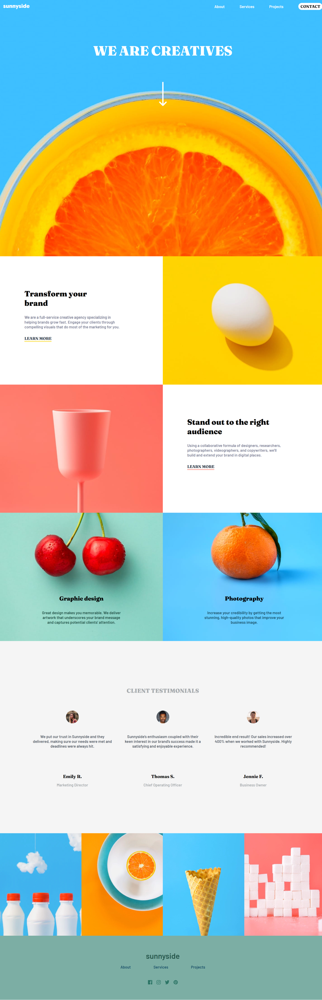

# Frontend Mentor - Sunnyside agency landing page solution

This is a solution to the [Sunnyside agency landing page challenge on Frontend Mentor](https://www.frontendmentor.io/challenges/sunnyside-agency-landing-page-7yVs3B6ef). Frontend Mentor challenges help you improve your coding skills by building realistic projects.

## Table of contents

- [Overview](#overview)
  - [The challenge](#the-challenge)
  - [Screenshot](#screenshot)
- [My process](#my-process)
  - [Built with](#built-with)
  - [What I learned](#what-i-learned)
  - [Continued development](#continued-development)

## Overview

### The challenge

Users should be able to:

- View the optimal layout for the site depending on their device's screen size
- See hover states for all interactive elements on the page

### Screenshot

## My process

### Built with

- Semantic HTML
- CSS custom properties
- CSS Flexbox
- CSS Grid
- SASS/SCSS
- JavaScript

### What I learned

This project provided a comperhensive overview of the following,
- CSS Flexbox
- CSS Grid
- Background Images in CSS

### Continued development

This project helped be better understand background images. I tried incorporating transition effects for click event yet was unable to do so. As such I aim to improve,

- Understanding of `transition` CSS property
- CSS Animations
